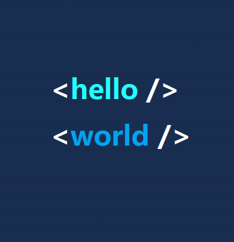

>一个开发中的小技巧，很实用。原理是利用inline-block元素的vertical-align实现居中的。

```html
<!DOCTYPE html>
<html lang="en">
<head>
    <meta charset="UTF-8">
    <meta name="viewport" content="width=device-width, initial-scale=1.0">
    <meta http-equiv="X-UA-Compatible" content="ie=edge">
    <title>行内块元素的自适应居中</title>
</head>
<style>
    * {
        padding: 0;
        margin: 0;
    }
    div {
        height: 300px;/*可随意更改，不影响居中*/
        background-color: aquamarine;
        text-align: center;
    }
    div::after{
        display: inline-block;/*行内块元素*/
        vertical-align: middle;/*vertical-align属性只对行内块元素起作用*/
        content: '';
        height: 100%;/*让这个伪类高度撑满父级*/
    }
    img {
        width: 100px;
        vertical-align: middle;/*图片是最常见行内块元素*/
    }
</style>

<body>
    <div>
        
    </div>
</body>
</html>
```
现象：


我们给父div的伪类再加一些属性，让它看上去更明显：
```css
 div::after{
        display: inline-block;/*行内块元素*/
        vertical-align: middle;/*vertical-align属性只对行内块元素起作用*/
        content: '';
        height: 100%;/*让这个伪类高度撑满父级*/
        background: blueviolet;
        width: 10px;
    }
```
现象：


[查看这个例子](https://github.com/KevinShowli/blog/blob/master/demos/inline-block.html)